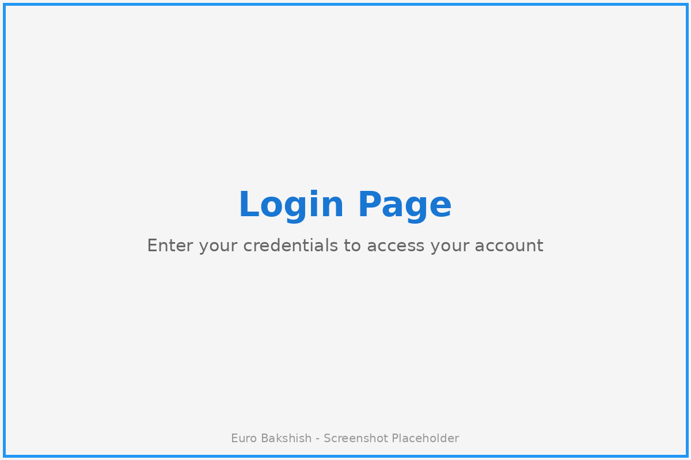
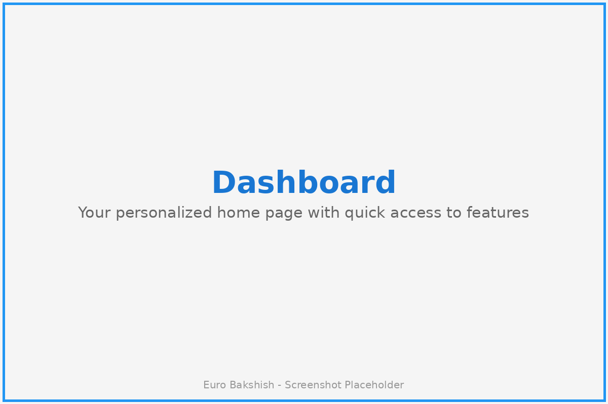
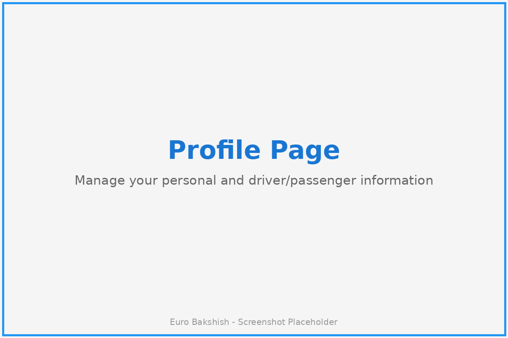
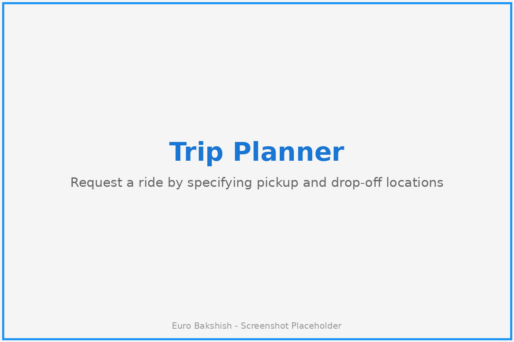
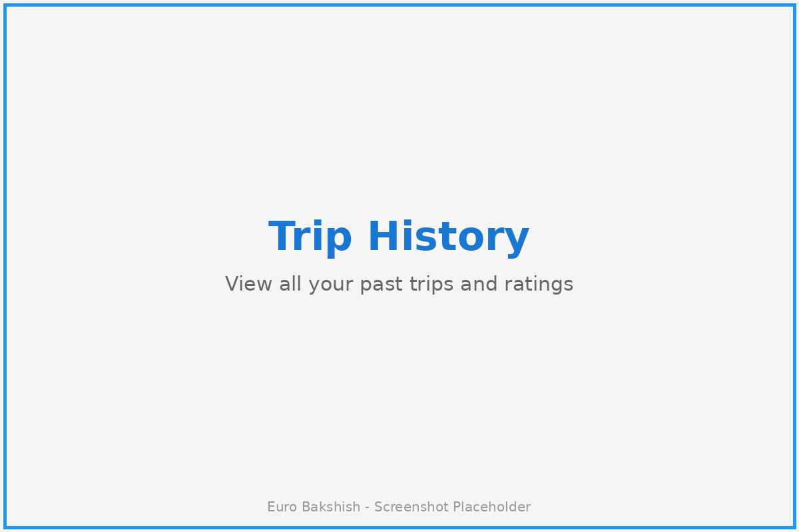
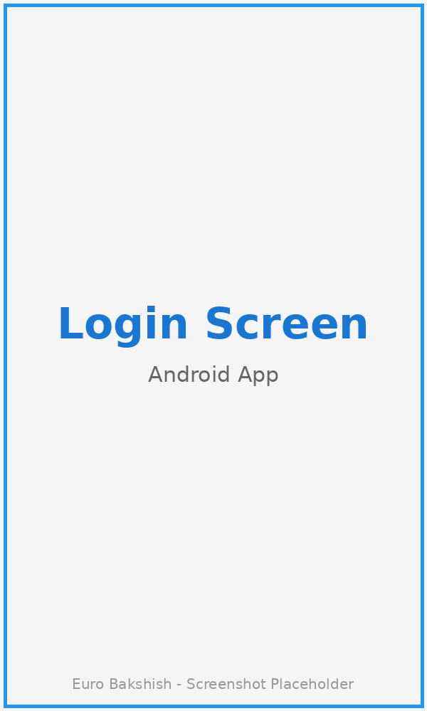
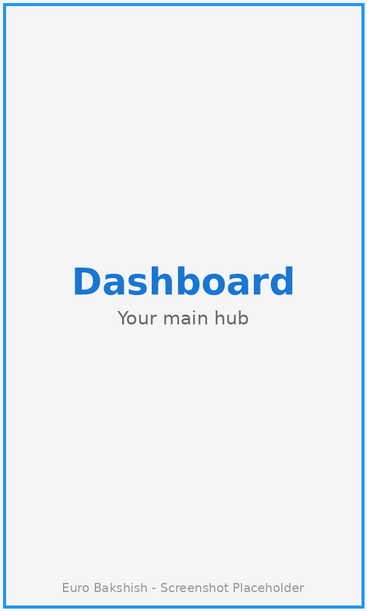
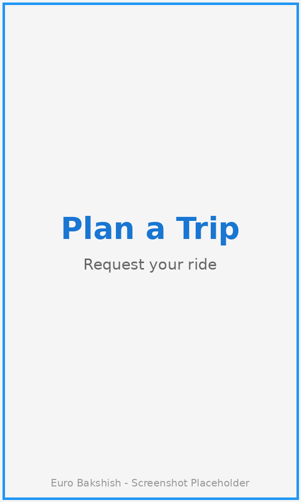

# Euro Bakshish - User Tutorial

Welcome to Euro Bakshish! This comprehensive tutorial will guide you through using both the web application and Android app to enjoy our ride-sharing platform.

## Table of Contents

1. [Getting Started](#getting-started)
2. [Web Application Tutorial](#web-application-tutorial)
3. [Android Application Tutorial](#android-application-tutorial)
4. [Common Tasks](#common-tasks)
5. [Troubleshooting](#troubleshooting)

---

## Getting Started

Euro Bakshish is a modern ride-sharing platform that connects passengers with drivers. Whether you're a passenger looking for a ride or a driver offering your services, this guide will help you get started.

### Account Types

- **Passenger**: Request rides and rate drivers
- **Driver**: Accept ride requests and earn ratings
- **Both**: You can be both a passenger and driver

---

## Web Application Tutorial

### 1. Registration and Login

#### Creating an Account

1. **Navigate to the Registration Page**
   - Open your web browser and go to `http://localhost` (or your deployment URL)
   - Click on "Register" or "Sign Up"

   

2. **Fill in Your Details**
   - **Username**: Choose a unique username
   - **Email**: Enter your email address
   - **Password**: Create a secure password
   - **Confirm Password**: Re-enter your password
   - **First Name**: Your first name
   - **Last Name**: Your last name
   - **User Type**: Select one of the following:
     - Passenger
     - Driver
     - Both

3. **Submit Registration**
   - Click the "Register" button
   - You'll be redirected to the login page upon successful registration

#### Logging In

1. **Access the Login Page**
   - Navigate to `http://localhost` (or your deployment URL)
   - Enter your username and password
   
   

2. **Click "Login"**
   - You'll be redirected to your dashboard

### 2. Dashboard Overview

After logging in, you'll see your personalized dashboard.

**Dashboard Features:**
- **User Type**: Displays whether you're a Passenger, Driver, or Both
- **Active Trips**: Shows the number of your current active trips
- **Total Trips**: Displays your total trip history count
- **Quick Actions**: Access to main features like:
  - Plan a new trip
  - View trip history
  - Update profile

### 3. Setting Up Your Profile

#### For Passengers

1. **Navigate to Profile**
   - Click on "Profile" in the navigation bar
   
   

2. **Complete Passenger Profile**
   - **Payment Method**: Enter your preferred payment method
   - **Phone Number**: Add your contact number
   - **Emergency Contact**: Add emergency contact information
   - Click "Save Changes"

#### For Drivers

1. **Navigate to Profile**
   - Click on "Profile" in the navigation bar

2. **Complete Driver Profile**
   - **Vehicle Details**:
     - Make and Model (e.g., "Toyota Camry")
     - Year (e.g., "2020")
     - Color
     - License Plate Number
   - **License Information**:
     - Driver's License Number
     - License Expiration Date
   - **Availability Status**: Set to "Available" when ready to accept rides
   - Click "Save Changes"

### 4. Planning a Trip (Passengers)

1. **Access Trip Planner**
   - From the dashboard, click "Plan Trip" or navigate to "Trip Planner"
   
   

2. **Enter Trip Details**
   - **Starting Location**: Enter or select your pickup location
   - **Destination**: Enter or select your drop-off location
   - **Date and Time**: Select when you need the ride
   - **Notes**: Add any special instructions (optional)

3. **Submit Trip Request**
   - Click "Request Trip"
   - Your trip will be posted and visible to available drivers
   - Trip status will be "Pending" until a driver accepts

### 5. Accepting Trips (Drivers)

1. **View Available Trips**
   - Navigate to "Available Trips" from the dashboard
   - Browse through pending trip requests

2. **Accept a Trip**
   - Click on a trip to view details
   - Review the pickup and drop-off locations
   - Click "Accept Trip" if you're interested
   - Trip status changes to "Accepted"

3. **Start the Trip**
   - When you arrive at the pickup location, click "Start Trip"
   - Trip status changes to "In Progress"

4. **Complete the Trip**
   - When you reach the destination, click "Complete Trip"
   - Trip status changes to "Completed"

### 6. Trip History

View all your past trips and their details.

**Features:**
- Filter by date range
- View trip details
- See ratings received
- Access receipts

### 7. Rating System

After completing a trip, both passengers and drivers can rate each other.

1. **Access Pending Reviews**
   - Navigate to "Pending Reviews" from your dashboard
   - You'll see all completed trips that need ratings

2. **Submit a Rating**
   - Click on a trip to rate
   - Provide ratings for:
     - **Overall Rating**: 1-5 stars
     - **Punctuality**: How on-time was the person?
     - **Cleanliness**: (For drivers) Vehicle cleanliness
     - **Safety**: How safe did you feel?
     - **Communication**: How well did they communicate?
   - Add optional comments
   - Click "Submit Review"

3. **View Your Ratings**
   - Navigate to "My Ratings" to see ratings you've received
   - Your average rating is displayed on your profile

---

## Android Application Tutorial

### 1. Installing the App

1. **Download the APK**
   - Get the APK file from your administrator or build it from source

2. **Install the App**
   - Enable "Install from Unknown Sources" in your Android settings
   - Open the APK file and follow installation prompts

### 2. First-Time Setup

#### Registration

1. **Launch the App**
   - Open Euro Bakshish from your app drawer
   
   

2. **Tap "Register"**
   - Fill in the registration form:
     - Username
     - Email
     - Password
     - First Name
     - Last Name
     - User Type (Passenger/Driver/Both)
   - Tap "Create Account"

#### Login

1. **Enter Credentials**
   - Username
   - Password
   
   

2. **Tap "Login"**
   - You'll be taken to the main dashboard

### 3. Android Dashboard

The Android dashboard provides quick access to all features.

**Main Sections:**
- **Active Trips**: Current trips in progress
- **Plan Trip**: Request a new ride
- **Trip History**: View past trips
- **Profile**: Manage your profile
- **Settings**: App preferences

### 4. Creating a Trip Request (Android)

1. **Tap "Plan Trip"**
   
   

2. **Enter Trip Details**
   - **Pickup Location**: 
     - Use current location button
     - Or enter address manually
   - **Drop-off Location**: Enter destination
   - **Date/Time**: Select pickup time
   - **Notes**: Optional instructions

3. **Tap "Request Ride"**
   - Wait for driver acceptance
   - You'll receive a notification when a driver accepts

### 5. Driver Features (Android)

#### Setting Availability

1. **Go to Profile**
2. **Toggle "Available for Rides"**
3. **Save Changes**

#### Viewing Trip Requests

1. **Tap "Available Trips"**
   - Browse pending ride requests
   - View details like pickup/drop-off locations and distance

2. **Accept a Trip**
   - Tap on a trip to view full details
   - Tap "Accept" to confirm
   - Get directions to pickup location

#### Managing Active Trips

1. **Start Trip**
   - When you arrive, tap "Start Trip"
   - Navigate to destination

2. **Complete Trip**
   - When you arrive at destination, tap "Complete Trip"
   - Trip is marked as completed

### 6. Navigation Integration

The Android app integrates with Google Maps for navigation.

1. **From an Active Trip**
   - Tap "Navigate" to open Google Maps
   - Follow turn-by-turn directions

### 7. Notifications

The Android app sends notifications for:
- Trip acceptance by driver
- Trip start
- Trip completion
- New trip requests (for drivers)
- Rating reminders

**Managing Notifications:**
- Go to Settings > Notifications
- Toggle notification types on/off

### 8. Viewing Trip History (Android)

1. **Tap "Trip History"**
   
   

2. **Browse Past Trips**
   - Tap any trip to view details
   - See ratings
   - View route taken

### 9. Rating on Android

1. **After Trip Completion**
   - You'll receive a notification to rate
   - Or go to "Pending Reviews"

2. **Submit Rating**
   - Rate 1-5 stars for each category
   - Add optional comments
   - Tap "Submit"

---

## Common Tasks

### Canceling a Trip

#### Web Application
1. Navigate to "Active Trips"
2. Click on the trip you want to cancel
3. Click "Cancel Trip"
4. Confirm cancellation

#### Android App
1. Tap "Active Trips"
2. Select the trip
3. Tap "Cancel Trip"
4. Confirm

### Updating Payment Method

#### Web Application
1. Go to "Profile"
2. Scroll to "Payment Information"
3. Update payment details
4. Click "Save Changes"

#### Android App
1. Tap "Profile"
2. Tap "Payment Methods"
3. Update or add new payment method
4. Tap "Save"

### Changing Availability (Drivers Only)

#### Web Application
1. Navigate to "Profile"
2. Find "Driver Profile" section
3. Toggle "Availability Status"
4. Click "Save Changes"

#### Android App
1. Tap "Profile"
2. Toggle "Available for Rides"
3. Changes save automatically

### Viewing Ratings and Reviews

#### Web Application
1. Click on "My Ratings" in the navigation
2. View:
   - Average rating
   - Individual reviews
   - Rating breakdown by category

#### Android App
1. Tap "Profile"
2. Tap "My Ratings"
3. Scroll through reviews

---

## Troubleshooting

### Login Issues

**Problem**: Can't log in
- **Solution**: 
  - Verify username and password are correct
  - Check internet connection
  - Try resetting password

### Trip Not Showing Up

**Problem**: Created trip request not visible
- **Solution**:
  - Refresh the page/app
  - Check internet connection
  - Verify trip was successfully submitted

### Can't Accept Trips (Drivers)

**Problem**: Unable to accept trip requests
- **Solution**:
  - Ensure driver profile is complete
  - Check that availability status is set to "Available"
  - Verify vehicle information is filled in

### Rating Not Submitting

**Problem**: Can't submit review
- **Solution**:
  - Ensure all required fields are filled
  - Check internet connection
  - Try again later if server is busy

### App Crashes (Android)

**Problem**: App closes unexpectedly
- **Solution**:
  - Clear app cache (Settings > Apps > Euro Bakshish > Clear Cache)
  - Ensure app is up to date
  - Restart device
  - Reinstall app if problem persists

### Location Not Working

**Problem**: Can't set pickup/drop-off location
- **Solution**:
  - Enable location permissions for the app
  - Check GPS is enabled on device
  - Try entering address manually

---

## Getting Help

If you encounter issues not covered in this tutorial:

1. **Check Documentation**: Visit the [GitHub repository](https://github.com/b-marinov/euro_bakshish) for detailed documentation
2. **Report Issues**: Open an issue on GitHub with detailed description
3. **Contact Support**: Reach out to your system administrator

---

## Tips for a Great Experience

### For Passengers
- ✓ Provide clear pickup instructions in trip notes
- ✓ Be ready at pickup location when driver arrives
- ✓ Rate drivers promptly after trips
- ✓ Keep emergency contact information updated

### For Drivers
- ✓ Keep driver profile information current
- ✓ Maintain accurate availability status
- ✓ Communicate with passengers about arrival time
- ✓ Ensure vehicle information is accurate
- ✓ Rate passengers to help the community

---

## Safety Tips

1. **Verify Driver/Passenger**: Check profile details before starting trip
2. **Share Trip Details**: Let someone know your trip details
3. **Use In-App Communication**: Keep communication within the platform
4. **Emergency Contact**: Keep emergency contact information updated
5. **Report Issues**: Report any safety concerns immediately

---

## Conclusion

Euro Bakshish makes ride-sharing simple and efficient. Whether you're using the web application or Android app, you now have all the knowledge to make the most of the platform.

**Happy riding!** 🚗✨

---

*Last Updated: January 2026*
